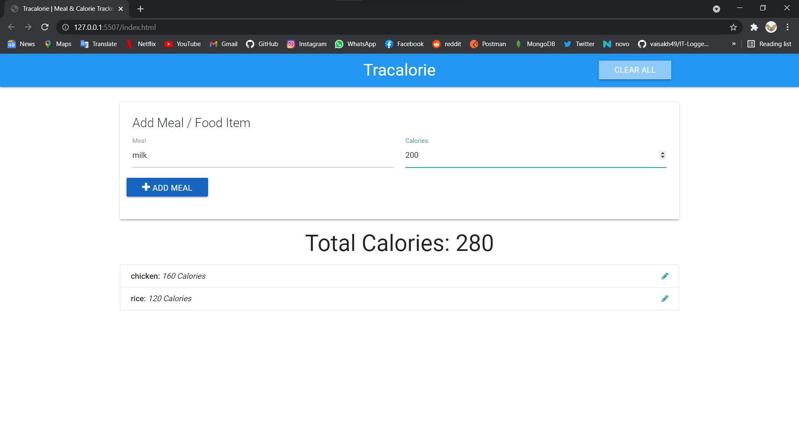
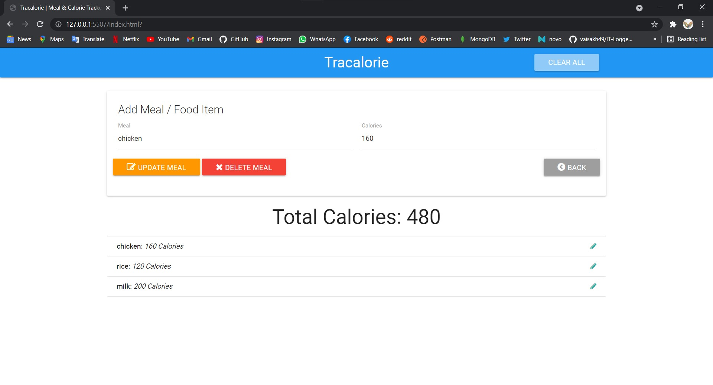

# trackalorie_js
A app can track and save our daily basis food calories.

<a href='https://jolly-bhaskara-7cfa0e.netlify.app/'>Go to site</a>

<h2>Screenshots</h2>

<h3>Add food item</h3>
 
 <h3>Update/Delete food item</h3>
 

